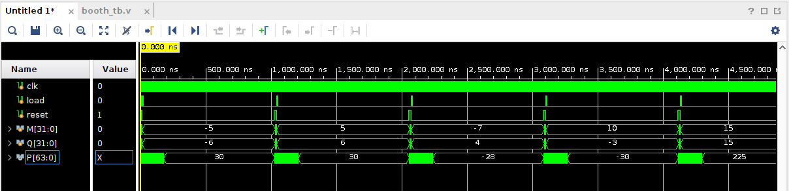
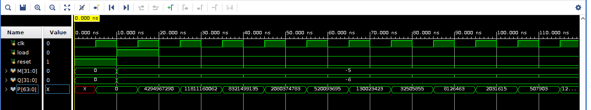
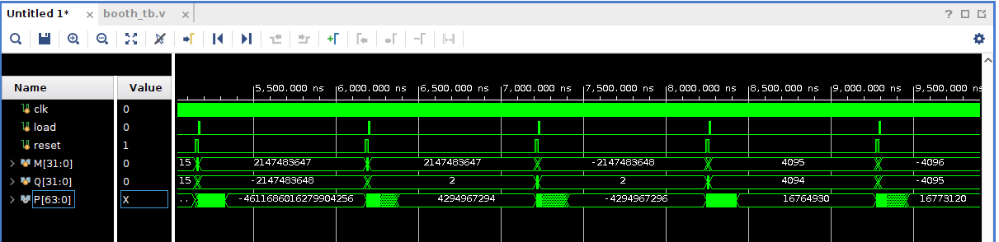
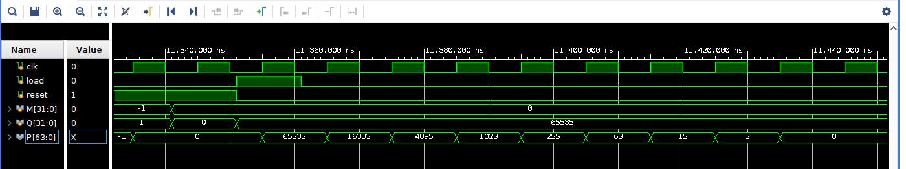
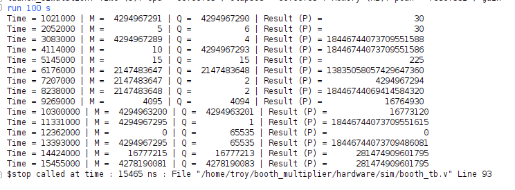

# Booth's Multiplication

## Project Overview

This project implements a hardware-based signed multiplication system using Booth's recoding algorithm in Verilog. The design focuses on multiplying two signed inputs, each represented in two's complement form, and producing an accurate signed product. By applying radix-four Booth's recoding, the algorithm evaluates pairs of bits from the multiplier along with a previously stored bit to determine whether to add, subtract, or skip operations involving the multiplicand. This reduces the number of required cycles and optimizes performance compared to more basic multiplication methods. The system includes proper sign extension to handle negative values and preserves arithmetic correctness throughout the computation. A testbench is used to validate functionality across a range of edge cases, ensuring that the design operates correctly with both small and large signed inputs.

Both the main Verilog module and the corresponding testbench can be found in the hardware folder.

## Simulation Output

Below is a waveform of the Booth's multiplier beginning its operation:

Here's a zoomed-in view of the internal multiplication process:

And this image shows multiple test results running sequentially:

This image shows the internal multiplication/division (shifting right/left) that occurs during the multiplication process:

Below is the console output of this testbench:

